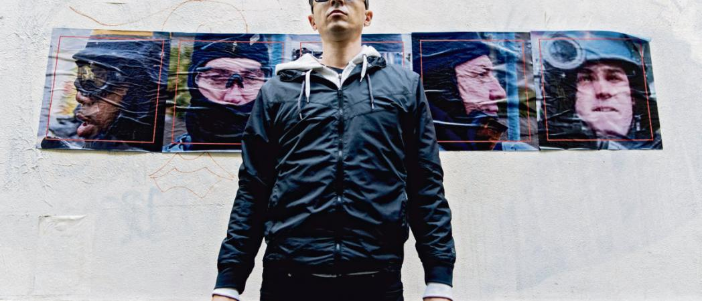

https://www.humanite.fr/censure-au-fresnoy-darmanin-aime-bien-les-artistes-qui-se-tiennent-sages-696926#xtor=RSS-1

# Censure. Au Fresnoy, Darmanin aime bien les artistes qui se tiennent sages

> Le ministre de l’Intérieur a obtenu le retrait d’une œuvre d’art qui dénonçait la dangerosité de la reconnaissance faciale lors d’une exposition. Avec la reconnaissance du syndicat de policiers Synergie-Officiers

Le 15 octobre dernier, l’installation _Capture_, de l’artiste italien Paolo Cirio, devait être présentée au Fresnoy, le Studio national des arts contemporains à Tourcoing. L’artiste avait conçu un panorama de 150 portraits photographiques de policiers français, déployé sur plusieurs mètres de large. À partir de l’utilisation d’un logiciel libre de reconnaissance faciale, Cirio – en collaboration avec les associations la Quadrature du Net, We Sign It et Labo 148 – avait ainsi créé une base de données de plus de 4 000 photographies. L’œuvre était accompagnée d’une pétition pour l’interdiction de la reconnaissance faciale en Europe. _« J’ai inversé l’utilisation de ces logiciels de reconnaissance faciale de manière à provoquer une prise de conscience auprès du public. L’absence de règlementation sur la protection de la vie privée (...) se retourne finalement contre les mêmes autorités qui en préconisent l’utilisation,_ explique ­l’artiste. _Je voulais montrer le déséquilibre entre leur utilisation par la police, qui ­n’hésite pas à cacher les visages ou les ­numéros d’identification individuels des policiers. Mon objectif était de réaliser une performance collaborative pour dénoncer de tels agissements. »_

Tout était prêt donc pour le 15 octobre, date d’inauguration de l’exposition de ­Panorama 22, rendez-vous annuel de la création du Fresnoy. La thématique de cette année, « les sentinelles », ne pouvait pas mieux tomber au regard de l’actualité. « Tout comme les sentinelles, les artistes veillent aux dangers qui menacent nos ­sociétés », écrivait alors Alain Fleischer, directeur du Fresnoy. Une cinquantaine d’œuvres étaient ­exposées, dont celle de Paolo Cirio _._ ­Or _Capture,_ ce jour-là, est recouverte de grands panneaux en bois.

Cirio n’avait pas anticipé la réaction de l’ex-maire de Tourcoing
-----------------------------------------------------------------

Il faut dire que, dès le 1er octobre, le ­ministre de l’Intérieur, Gérald Darmanin, dénonçait l’artiste sur Twitter en ces termes : _« Paolo Cirio : Insupportable mise au pilori de femmes et d’hommes qui risquent leur vie pour nous protéger. Je demande la déprogrammation de “l’exposition” et le retrait des photos de son site, sous peine de saisir les juridictions compétentes. » « J’avais anticipé une réaction négative de la part des syndicats de police ainsi que peut-être une polémique dans les médias. Mais je n’attendais pas u_ _ne intervention de la part du ministre de l’Intérieur,_ explique Cirio. _J’ai su très tard qu’il avait été maire de Tourcoing et vice-président du Fresnoy. »_

Le 2 octobre, Alain Fleischer, ­directeur du Fresnoy, publie un communiqué bien loin de ses écrits précédents: _« Le Fresnoy a toujours suivi avec intérêt les ­_ _recherches de Paulo Cirio, artiste ­reconnu sur la scène internationale pour sa critique et sa dénonciation des risques de l’intelligence artificielle, par exemple dans les techniques de reconnaissance faciale. À ce titre, son invitation comme artiste professeur invité nous semblait justifiée et légitime. (…) Mais nous ne pouvons en aucun cas ­adhérer à_ _une démarche qui associe l’œuvre en question à une plateforme numérique où l’artiste invite le public à identifier et désigner nommément des policiers (…). En conséquence, nous sommes au regret de devoir renoncer à la présentation de l’œuvre de Paulo Cirio. »_ Aussitôt, le syndicat ­Synergie-Officiers réagit en ces termes : _« Merci à ­ @GDarmanin pour la promptitude de sa réaction et sa fermeté pour ­défendre les #policiers et leurs familles. Son intervention a permis de déprogrammer une entreprise criminogène sous couvert d’une démarche artistique. »_

Paulo Cirio regrette la décision de la ­direction de l’école, qui _« savait de quoi retournait le projet et m’avait demandé de les tenir au courant »_. Cette décision de déprogrammer cette œuvre a provoqué de vives réactions chez un certain nombre d’étudiants et de professeurs du Fresnoy, qui ont perturbé le vernissage de Panorama 22 par la lecture d’une lettre ouverte dans laquelle ils dénonçaient les pressions morales exercées par un ministre d’État sur une école d’art.

Depuis, le confinement est passé par là. L’exposition est temporairement fermée. Et depuis samedi des centaines de milliers de personnes ont manifesté contre les violences policières…

Wilson Tarbox
<link rel="stylesheet" href="https://newdevprojects.github.io/ACV-CSC/kult.css">